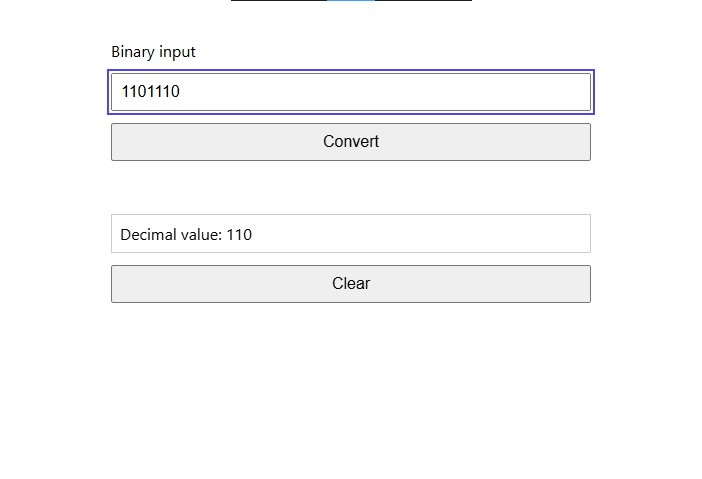

🧠 Bin2Dec — Binary to Decimal Converter

Convert binary numbers (base-2) into decimal numbers (base-10) right in your browser. This project is a beginner-friendly JavaScript application built with HTML, CSS, and vanilla JavaScript as part of learning DOM manipulation and basic app logic.

🚀 Demo

Here you can include a screenshot or an animated GIF of your app in action.
Place a file in your repo and reference it like:

📌 Overview

Bin2Dec is a simple web interface where users can:

Enter a binary number

Convert it to a decimal number

See live feedback if the input is invalid

It teaches you:

input validation

basic DOM manipulation

modular JavaScript file structure

handling user interactions

🧩 Features

✔ User input for binary numbers
✔ Conversion via button click
✔ Input validation (only 0s and 1s accepted)
✔ Error messaging
✔ Clean, minimal UI

💡 How It Works

This app separates the conversion logic from UI wiring:

bin2dec.js contains pure functions that:

check if a string is valid binary

convert binary string to decimal number

main.js:

selects DOM elements

attaches event listeners

calls logic functions and updates display

This structure makes the code easy to reason about and maintain.

🛠 How to Use Locally

Clone the repo

git clone https://github.com/yourusername/bin2dec.git

Open index.html with Live Server in VS Code
(or double-click to open in your browser)

Enter a binary number like 1011
→ you’ll see 11 as output

🧪 Test Cases

Valid inputs

0 → 0

1 → 1

1011 → 11

0001 → 1

Invalid inputs

2, 10201, 10a → error

empty string → prompt to enter a value

These tests help validate edge cases and error handling.

📦 Tools Used

✔ Visual Studio Code
✔ Git & GitHub
✔ HTML / CSS
✔ Vanilla JavaScript

Libraries: none — this app uses plain JavaScript and web APIs.

🤝 Contributing

This project is a learning exercise. You can improve it by:

adding a copy-to-clipboard feature

showing conversion history

improving accessibility

adding animations or visual polish

Feel free to fork, experiment, and submit improvements!
